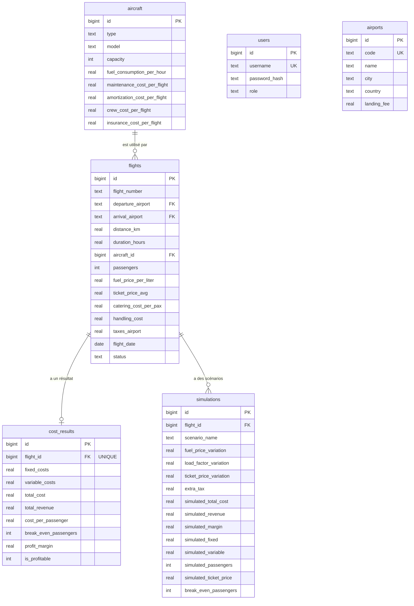

# Architecture & modèle de données

Ce document décrit l'architecture technique de l'application **Royal Air Maroc —
Calculateur de coûts des vols**, son modèle de données, et le correspondance entre
l'interface (onglets), l'API et le code.

## Vue d'ensemble

```
┌─────────────┐   HTTP (JSON)   ┌──────────────┐   SQL      ┌────────────┐
│  Frontend   │ ──────────────► │   Backend    │ ─────────► │ PostgreSQL │
│ React/Vite  │   :8000/api     │   FastAPI    │   :5432    │            │
└─────────────┘                 └──────┬───────┘            └────────────┘
                                      │ HTTP
                                      ▼
                                ┌────────────┐
                                │   Ollama   │  (chatbot, modèle llama3.2)
                                └────────────┘
```

- **Frontend** : React + Vite + TypeScript + Tailwind + shadcn/ui (dossier `frontend/`).
- **Backend** : FastAPI + psycopg (dossier `backend/`), calculs numériques appuyés sur NumPy/SciPy.
- **Base de données** : PostgreSQL 16 (conteneur `db`).
- **Chatbot** : Ollama (conteneur `ollama`), modèle `llama3.2`.
- **Desktop** : coquille Electron (dossier `desktop/`) servant le frontend compilé.

Tout est orchestré avec Docker Compose (`docker-compose.yml`).

## Correspondance onglet ↔ route ↔ fichier

| Onglet (UI) | Route frontend | Router backend | Fichier page | Fichier router |
| --- | --- | --- | --- | --- |
| Connexion | `/login` | `/api/auth` | `LoginPage.tsx` | `auth.py` |
| Tableau de Bord | `/dashboard` | `/api/dashboard` | `DashboardPage.tsx` | `dashboard.py` |
| Vols | `/flights` | `/api/flights` | `FlightsPage.tsx` | `flights.py` |
| Flotte | `/aircraft` | `/api/aircraft` | `AircraftPage.tsx` | `aircraft.py` |
| Aéroports | `/airports` | `/api/airports` | `AirportsPage.tsx` | `airports.py` |
| Scénarios | `/simulation` | `/api/simulation` | `SimulationPage.tsx` | `simulation.py` |
| Prévision | `/forecast` | `/api/forecast` | `ForecastPage.tsx` | `forecast.py` |
| Risque & Rendement | `/decision` | `/api/decision` | `DecisionPage.tsx` | `decision.py` |
| Utilisateurs | `/users` | `/api/users` | `UsersPage.tsx` | `users.py` |
| — (chatbot intégré) | — | `/api/chatbot` | `ChatbotWidget.tsx` | `chatbot.py` |

> Note : le nom de l'onglet ne correspond pas toujours au nom de la route. Par
> exemple, « Scénarios » ↔ `/simulation`, « Risque & Rendement » ↔ `/decision`.

## Modèle de données

Six tables sont créées automatiquement au démarrage (`database.py`) :

| Table | Rôle | Relations |
| --- | --- | --- |
| `users` | Comptes et rôles (`admin` / `analyst`) | — |
| `aircraft` | Caractéristiques et coûts des avions | — |
| `airports` | Codes IATA et redevances d'atterrissage | — |
| `flights` | Un vol (route, avion, passagers, tarifs) | `aircraft_id → aircraft.id`<br>`departure_airport → airports.code`<br>`arrival_airport → airports.code` |
| `cost_results` | Résultat de calcul de coût (1:1 avec un vol) | `flight_id → flights.id` (UNIQUE) |
| `simulations` | Historique des scénarios simulés | `flight_id → flights.id` |

### Diagramme des relations



## Formule de calcul du coût

Le calcul (`services/cost.py` → `compute_cost`) sépare les coûts en deux familles :

**Coûts fixes** (indépendants du remplissage) :
```
fixed = amortissement + équipage + assurance
```

**Coûts variables** (dépendent du vol et du remplissage) :
```
fuel_cost = consommation_L/h × durée_h × prix_carburant/L
variable = fuel_cost + maintenance + (catering/pax × passagers) + handling + taxes
```

**Résultats** :
```
total_cost = fixed + variable
revenue = prix_billet × passagers
cost_per_passenger = total_cost / max(passagers, 1)
profit_margin = (revenue − total_cost) / total_cost × 100
break_even = fixed / (prix_billet − variable/passager) + 1
is_profitable = revenue ≥ total_cost
```

> **Vol cargo** (0 passager) : le calcul de coût est volontairement ignoré
> (`passengers > 0` requis pour générer un `cost_results`). Ces vols n'apparaissent
> donc ni dans le tableau de bord ni dans la prévision.

## Inventaire de l'API

Toutes les routes sont préfixées par `/api`. Sauf indication, elles nécessitent un
en-tête `Authorization: Bearer <token>` (obtenu via `/api/auth/login`).

| Méthode | Chemin | Description | Accès |
| --- | --- | --- | --- |
| POST | `/auth/login` | Connexion → JWT | public |
| GET | `/flights` | Lister les vols (+ coûts joints) | connecté |
| POST | `/flights` | Créer un vol | connecté |
| GET | `/flights/{id}` | Détail d'un vol | connecté |
| PUT | `/flights/{id}` | Modifier un vol | connecté |
| DELETE | `/flights/{id}` | Supprimer un vol | connecté |
| POST | `/flights/{id}/calculate` | Calculer & enregistrer le coût | connecté |
| GET | `/flights/{id}/cost` | Lire le résultat de coût | connecté |
| POST | `/flights/import` | Importer un vol (Excel `.xlsx`) | connecté |
| GET | `/aircraft` | Lister les avions | connecté |
| POST | `/aircraft` | Créer un avion | connecté |
| PUT | `/aircraft/{id}` | Modifier un avion | connecté |
| DELETE | `/aircraft/{id}` | Supprimer un avion | connecté |
| GET | `/airports` | Lister les aéroports | connecté |
| POST | `/airports` | Créer un aéroport | connecté |
| PUT | `/airports/{code}` | Modifier un aéroport | connecté |
| DELETE | `/airports/{code}` | Supprimer un aéroport | connecté |
| GET | `/dashboard/stats` | Statistiques du tableau de bord | connecté |
| GET | `/dashboard/pdf` | Rapport PDF du tableau de bord | connecté |
| POST | `/simulation/simulate` | Lancer un scénario | connecté |
| GET | `/simulation/presets` | Lister les scénarios prédéfinis | connecté |
| GET | `/simulation/{flight_id}/history` | Historique des scénarios d'un vol | connecté |
| DELETE | `/simulation/history/{id}` | Supprimer une simulation | connecté |
| POST | `/forecast` | Prévision par régression linéaire | connecté |
| POST | `/decision/kpis` | Indicateurs aéronautiques | connecté |
| POST | `/decision/monte-carlo` | Analyse de risque | connecté |
| POST | `/decision/optimize` | Optimisation du prix | connecté |
| GET | `/users` | Lister les utilisateurs | admin |
| POST | `/users` | Créer un utilisateur | admin |
| PUT | `/users/{id}` | Modifier un utilisateur | admin |
| DELETE | `/users/{id}` | Supprimer un utilisateur | admin |
| POST | `/chatbot` | Message au chatbot (Ollama) | connecté |
| GET | `/health` | État de santé de l'API | public |

## Authentification & sécurité

- **JWT HS256**, durée configurable (`RAM_TOKEN_EXPIRE`, défaut 720 min).
- **Clé secrète** : obligatoire via la variable d'environnement `RAM_SECRET_KEY`
  (aucun fallback en dur).
- **Mots de passe** : hachés en **bcrypt**. Les anciens hachages SHA-256 (versions
  antérieures) sont migrés automatiquement à la connexion.
- **Rôles** : `admin` (accès complet) et `analyst` (analyse seule, sans gestion
  des comptes). La route `/users` est protégée par `require_admin`.

## Services métier (backend)

| Fichier | Rôle |
| --- | --- |
| `services/cost.py` | Calcul de coût, sauvegarde, simulation, stats du dashboard |
| `services/decision.py` | KPI aéronautiques, Monte Carlo vectorisé (NumPy), optimisation du prix par balayage |
| `services/forecast.py` | Régression linéaire (moindres carrés, `scipy.stats.linregress`) |
| `services/pdf.py` | Génération du rapport PDF (reportlab) |

Voir les documents dédiés pour le détail de chaque fonctionnalité.
