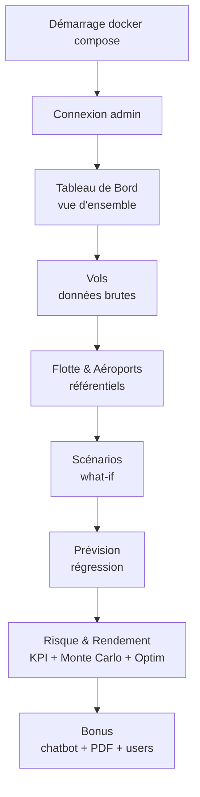
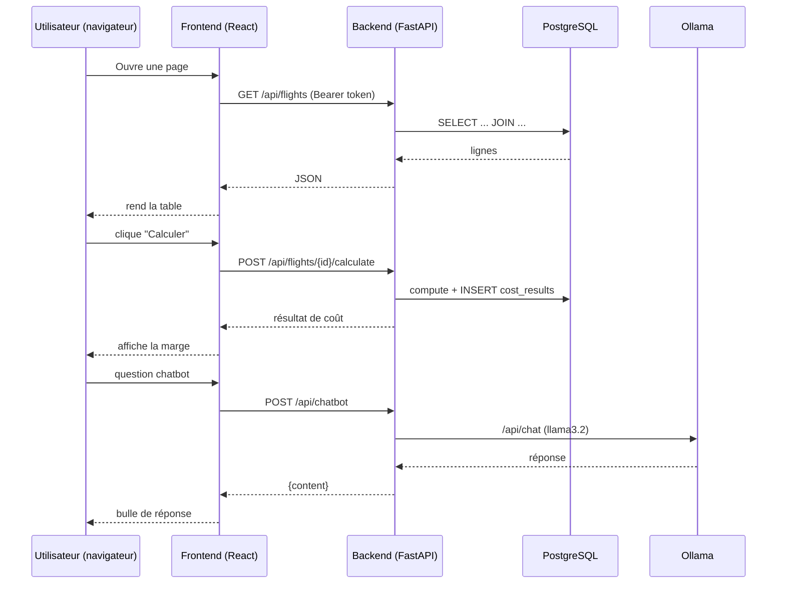
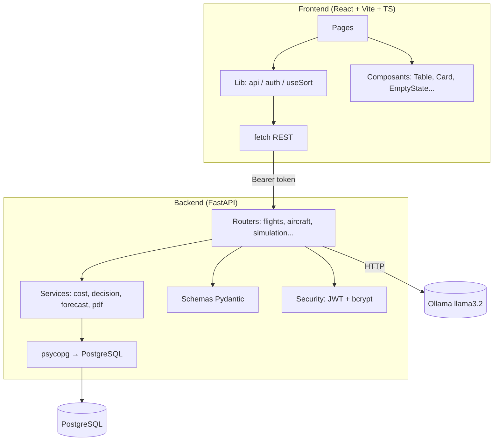
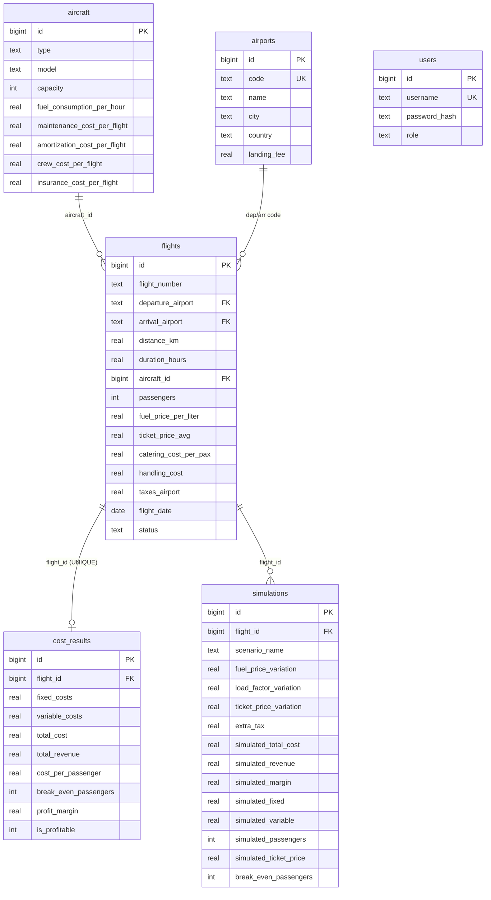
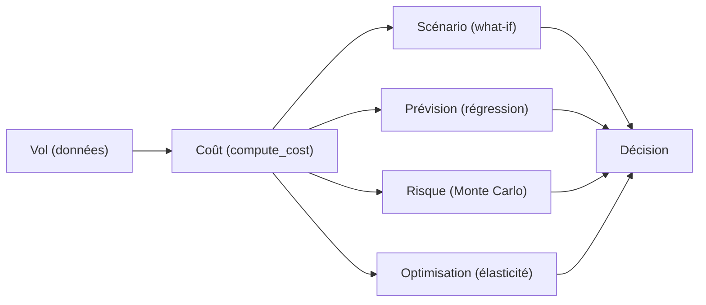

# Guide de présentation & documentation technique

> **Public** : développeur qui doit présenter le projet (soutenance de master) et le
> réutiliser ensuite comme base d'un rapport de 60 pages.
>
> Ce document sert à la fois de **script de démonstration**, de **support de
> pitch**, et de **référence technique** (architecture, code, fichiers, résultats
> attendus).

---

## Table des matières

1. [Le projet en 30 secondes](#1-le-projet-en-30-secondes)
2. [Pitch — la valeur métier](#2-pitch--la-valeur-métier)
3. [La démonstration pas-à-pas](#3-la-démonstration-pas-à-pas)
4. [Les résultats que l'on doit voir](#4-les-résultats-que-lon-doit-voir)
5. [Comment le code fonctionne (interne)](#5-comment-le-code-fonctionne-interne)
6. [Structure des fichiers](#6-structure-des-fichiers)
7. [Modèle de données & diagrammes](#7-modèle-de-données--diagrammes)
8. [Formules métier](#8-formules-métier)
9. [Sécurité](#9-sécurité)
10. [Points de discussion / défense](#10-points-de-discussion--défense)

---

## 1. Le projet en 30 secondes

**Royal Air Maroc — Calculateur de coûts des vols** est une application web full-stack
qui répond à une question simple et universelle pour une compagnie aérienne :

> *« Combien coûte réellement un vol, est-il rentable, qu'est-ce qui pourrait mal
> tourner, et comment maximiser le profit ? »*

Elle transforme des données de vol brutes (route, avion, passagers, prix du
carburant, tarif) en **décisions** :

- **Calculer** le coût et la marge d'un vol (analyse statique).
- **Simuler** des chocs (carburant, remplissage, tarif, taxe) — analyse « what-if ».
- **Prévoir** les tendances futures (régression linéaire).
- **Quantifier le risque** (Monte Carlo) et **optimiser le prix** (élasticité).

C'est un **outil d'aide à la décision** pour la direction des opérations aériennes,
pas un simple CRUD.

---

## 2. Pitch — la valeur métier

### Le problème

Une compagnie aérienne exploite des dizaines de routes, chacune avec des avions,
des coûts fixes et variables, des remplissages et des tarifs qui varient chaque
semaine. Sans outil, il est presque impossible de répondre précisément à :

- Quels vols **perdent** de l'argent sans qu'on le voie ?
- Quel est le **seuil de rentabilité** (nombre de passagers / taux de remplissage) ?
- Comment un **choc pétrolier** impacterait-il la marge ?
- Quel **prix de billet** maximise le profit d'une ligne ?

### La solution

Une application qui centralise la flotte, les aéroports et les vols, calcule le
coût réel de chaque vol, puis fournit quatre couches d'analyse :

```
  [Coût]  →  [Scénarios]  →  [Prévision]  →  [Risque & Optimisation]
 (base)      (what-if)       (tendance)       (décision)
```

### Les points forts à mettre en avant

| Atout | Pourquoi ça compte |
| --- | --- |
| **Full-stack** | React + FastAPI + PostgreSQL, le tout Dockerisé |
| **IA embarquée** | Chatbot assistant (Ollama / llama3.2) |
| **Analyse quantitative** | Régression via `scipy.stats.linregress`, Monte Carlo vectorisé (NumPy), optimisation par balayage sur la pile scientifique standard |
| **Sécurité** | JWT, bcrypt, rôles, clés secrètes |
| **Analyse aéronautique réelle** | KPI standards de l'industrie (ASK, RASK, CASK, BELF, yield) |
| **Export/Import** | PDF (reportlab) + Excel (openpyxl) |

---

## 3. La démonstration pas-à-pas

> **Script conseillé** : suivre dans cet ordre pour raconter une histoire cohérente.



### Étape 0 — Démarrage

```bash
cp .env.example .env        # puis renseigner RAM_SECRET_KEY
docker compose up -d --build
```

Ouvrir http://localhost:5173 et se connecter (`admin` / `admin123`).

### Étape 1 — Tableau de Bord (vue d'ensemble)

- On voit **176 vols analysés** (les 2 vols cargo sont hors analyse), ~82
  rentables / ~94 déficitaires, un taux global de rentabilité (~47 %), la marge
  moyenne, le profit net.
- **À dire** : « C'est la photo d'ensemble. Le réseau est globalement borderline —
  il y a de bons vols et de mauvais vols mélangés. »

### Étape 2 — Vols (données brutes)

- La table liste **178 vols** (séries hebdomadaires par route).
- On peut **trier** les colonnes, **calculer** le coût d'un vol (icône 🧮),
  **importer** un Excel, **créer/modifier/supprimer**.
- **À dire** : « Chaque ligne = un vol réel. Un même numéro revient chaque semaine
  (c'est une série temporelle, pas des doublons). »

### Étape 3 — Flotte & Aéroports (données de référence)

- 7 avions (leur coût horaire/vol), 25 aéroports (codes IATA + redevances).
- Les aéroports sont liés aux vols par **clé étrangère**.

### Étape 4 — Scénarios (le laboratoire)

- Choisir un vol, cliquer un **scénario prédéfini** (ex. « Choc pétrolier »,
  « Pic de demande »), lancer.
- **À dire** : « Je peux stresser un vol en un clic et voir instantanément l'impact
  sur la marge. L'historique est cliquable : je peux recharger n'importe quel
  scénario passé. »

### Étape 5 — Prévision (tendance)

- Choisir un avion (ex. 787-9 qui monte, vs ATR-72 qui descend).
- **À dire** : « La régression linéaire prolonge l'historique pour anticiper la
  rentabilité future de chaque appareil. »

### Étape 6 — Risque & Rendement (la décision)

Trois sous-outils :
1. **Santé du vol** (KPI) → RASK vs CASK, load factor vs BELF.
2. **Risque (Monte Carlo)** → probabilité de perte + histogramme.
3. **Optimisation du prix** → meilleur prix + meilleur avion.

- **À dire** : « J'identifie un vol déficitaire, je mesure son risque, et je trouve
  comment le rendre rentable (changer le prix, voire l'avion). »

### Étape 7 — Bonus

- **Chatbot** : poser une question (bouton flottant en bas à droite).
- **Export PDF** : télécharger le rapport du tableau de bord.
- **Utilisateurs** : créer un rôle `analyst` sans accès admin.

---

## 4. Les résultats que l'on doit voir

> Valeurs attendues avec le jeu de données de démonstration (après réinitialisation).

| Indicateur | Valeur attendue |
| --- | --- |
| Vols totaux | 178 (176 calculés + 2 cargo) |
| Vols rentables | ~82 |
| Vols déficitaires | ~94 |
| Taux de rentabilité | ~47 % |
| Avions | 7 |
| Aéroports | 25 |
| Scénarios prédéfinis | 7 |
| Meilleure route | AT-200 (CMN → JFK), marge ~+80 % |
| Pire route | AT-866 (CMN → BCN), marge ~-80 % |

**Messages clés :**
- Il existe une **forte dispersion** : certaines routes sont très rentables, d'autres
  chroniquement déficitaires.
- La **prévision** montre des tendances opposées selon l'appareil (→ décision de
  capacité).
- **Monte Carlo** révèle qu'un vol au profit moyen positif peut quand même avoir une
  probabilité de perte élevée (risque).
- **L'optimisation** peut recommander un avion différent, démontrant la valeur de
  l'analyse au-delà du simple calcul de coût.

---

## 5. Comment le code fonctionne (interne)

### Flux d'une requête



### Architecture en couches



### Points techniques internes

- **Séparation router / service / schéma** : les `routers/` ne font que recevoir et
  renvoyer ; la logique métier vit dans `services/` ; les contrats sont dans
  `schemas.py`.
- **NumPy / SciPy** : `forecast.py` utilise `scipy.stats.linregress` (moindres
  carrés) ; `decision.py` vectorise le Monte Carlo (générateur NumPy `default_rng`)
  et l'optimisation par balayage + élasticité (matrices broadcastées).
- **Déterminisme** : Monte Carlo fixe la graine (`random.seed(42)`) → résultats
  reproductibles (idéal pour une démo/soutenance).
- **Base auto-initialisée** : `database.py` crée les tables puis `seed_data.py`
  génère les données de démo (178 vols, 7 avions, 25 aéroports) au premier lancement.

---

## 6. Structure des fichiers

```
ram_v2/
├── docker-compose.yml          # Orchestration (db, ollama, backend, frontend)
├── .env.example                # Modèle pour les secrets
├── README.md                   # Démarrage rapide
├── modele_vol.xlsx             # Modèle d'import Excel
├── backend/
│   ├── Dockerfile
│   ├── requirements.txt        # fastapi, psycopg, bcrypt, openpyxl, reportlab...
│   └── app/
│       ├── main.py             # Application FastAPI + CORS + routers
│       ├── config.py           # Env vars (DATABASE_URL, RAM_SECRET_KEY, OLLAMA_URL)
│       ├── database.py         # Schéma SQL + seed
│       ├── seed_data.py        # Données de démo (avions, aéroports, vols)
│       ├── security.py         # bcrypt + JWT
│       ├── deps.py             # Dépendances (get_current_user, require_admin)
│       ├── schemas.py          # Modèles Pydantic (request/response)
│       ├── routers/            # 10 routers (un par domaine)
│       │   ├── auth.py  flights.py  aircraft.py  airports.py
│       │   ├── dashboard.py  simulation.py  forecast.py
│       │   ├── decision.py  users.py  chatbot.py
│       └── services/           # Logique métier
│           ├── cost.py  decision.py  forecast.py  pdf.py
├── frontend/
│   ├── Dockerfile              # build Vite → servir via preview
│   ├── vite.config.ts          # proxy /api → :8000
│   ├── package.json
│   └── src/
│       ├── main.tsx            # HashRouter + providers
│       ├── App.tsx             # Routes + garde d'authentification
│       ├── types.ts            # Types TypeScript (miroir des schemas)
│       ├── lib/                # api.ts, auth.tsx, useSort.ts, utils.ts
│       ├── components/         # EmptyState, LoadingSkeleton, SortableHeader...
│       └── pages/              # 9 pages (1 par onglet)
└── desktop/                    # Coquille Electron (optionnel)
    ├── main.cjs  preload.cjs  package.json
```

---

## 7. Modèle de données & diagrammes

### Schéma relationnel (ERD)



### Flux d'analyse en 4 étapes



---

## 8. Formules métier

### Coût d'un vol (`services/cost.py`)

```
Coûts fixes      = amortissement + équipage + assurance
Carburant        = consommation(L/h) × durée(h) × prix(L)
Coûts variables  = carburant + maintenance + catering×pax + handling + taxes

total_cost  = fixes + variables
revenue     = prix_billet × passagers
marge (%)   = (revenue − total_cost) / total_cost × 100
seuil (pax) = fixes / (prix_billet − variables/pax) + 1
rentable    = revenue ≥ total_cost
```

### Indicateurs aéronautiques (`services/decision.py` → compute_kpis)

```
ASK   = capacité × distance          (offre)
RPK   = passagers × distance         (demande)
LF    = passagers / capacité × 100   (taux de remplissage)
RASK  = revenu / ASK                 (recette par siège-km)
CASK  = coût / ASK                   (coût par siège-km)
Yield = revenu / RPK                 (recette par passager-km)
BELF  = CASK / RASK × 100            (seuil de rentabilité en % de remplissage)
```

### Monte Carlo (`services/decision.py` → monte_carlo)

Pour chacune des N simulations (défaut 5000) :

```
carburant ~ Normal(base, σ_carburant)
passagers ~ Normal(base, σ_passagers)  [borné 1..capacité]
billet    ~ Normal(base, σ_billet)
profit    = revenu − coût   (recalculé à chaque tirage)
```

Résultats : profit moyen, probabilité de perte, VaR 95 %, histogramme.

### Optimisation (`services/decision.py` → optimize)

Pour chaque avion, pour chaque prix dans [min, max] :

```
élasticité E = -0.5
remplissage  = charge_base × (prix/prix_base)^E
profit       = prix × passagers − coût   → garder le meilleur
```

Retourne la meilleure combinaison (avion, prix, profit).

---

## 9. Sécurité

| Sujet | Implémentation |
| --- | --- |
| Authentification | JWT HS256 (`security.py`), durée `RAM_TOKEN_EXPIRE` (défaut 720 min) |
| Clé secrète | `RAM_SECRET_KEY` obligatoire (`.env`, pas de fallback en dur) |
| Mots de passe | bcrypt (migration auto des anciens SHA-256) |
| Rôles | `admin` (tout) / `analyst` (sans gestion des comptes), `require_admin` |
| CORS | restreint à `localhost:5173` + `null` (Electron) |
| Secrets | jamais versionnés (`.env` dans `.gitignore`) |

Voir [`securite.md`](securite.md) pour le détail.

---

## 10. Points de discussion / défense

Voici les questions probables d'un jury et des éléments de réponse :

### « Pourquoi NumPy/SciPy pour la régression / le Monte Carlo ? »
- Pile **scientifique standard** : implémentation robuste et éprouvée (moindres
  carrés, générateur PCG64, percentiles/histogrammes) au lieu d'un code maison.
- **Vectorisation** : le Monte Carlo (5 000 scénarios) et le balayage de prix sur
  toute la flotte s'exécutent en une passe sur des tableaux NumPy — rapide et lisible.
- La formule de coût métier reste écrite explicitement dans `services/`, donc on
  conserve la traçabilité du modèle.

### « Le Monte Carlo est-il reproductible ? »
- Oui : graine fixe via `np.random.default_rng(42)` (PCG64), donc **déterministe**
  — idéal pour une démo et pour des tests.

### « Comment la donnée est-elle générée ? »
- `seed_data.py` produit des séries hebdomadaires réalistes (via un générateur
  linéaire `_weeks`) couvrant des cas bons, neutres et mauvais, volontairement.

### « Pourquoi un conteneur séparé pour Ollama ? »
- Découplage : le chatbot est un service optionnel ; on peut le désactiver sans
  casser l'app métier.

### « Qu'est-ce qui montre la robustesse ? »
- FK entre aéroports/flights/aircraft, validation des imports, messages d'erreur
  « friendly » (suppression d'un avion/aéroport utilisé), garde-fous cargo,
  gestion des rôles.

### « Limites connues ? »
- Le **fret** (cargo, passagers = 0) n'a pas de modèle économique propre (exclu des
  analyses passagers). C'est une piste d'extension naturelle.
- L'élasticité du prix est un coefficient fixe `-0.5` (simplification volontaire).

---

## Annexes : documents liés

- [Tableau de Bord](tableau-de-bord.md) · [Vols](vols.md) · [Flotte](flotte.md) · [Aéroports](aeroports.md)
- [Scénarios](scenarios.md) · [Prévision](prevision.md) · [Risque & Rendement](risque-rendement.md) · [Utilisateurs](utilisateurs.md)
- [Architecture & modèle de données](architecture.md) · [Sécurité](securite.md) · [Chatbot](chatbot.md) · [Import Excel](import-excel.md)
